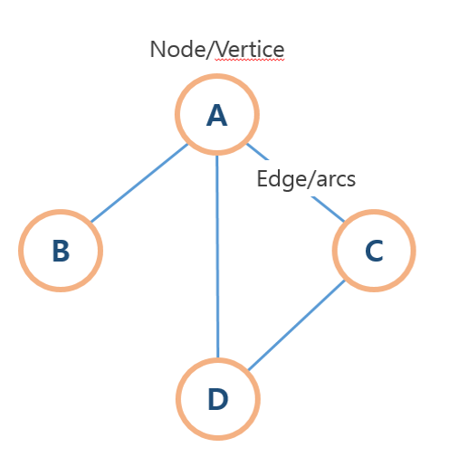
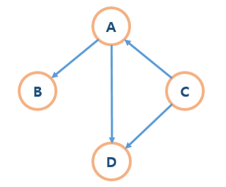
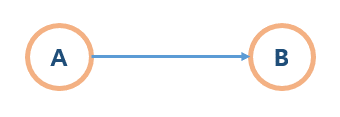
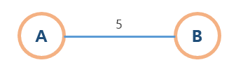
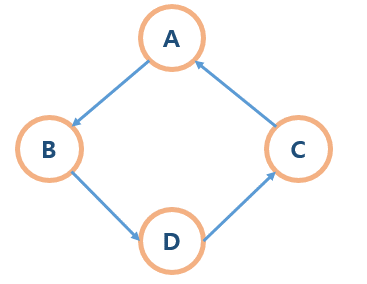
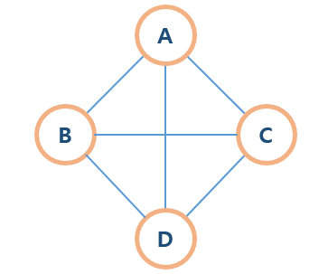
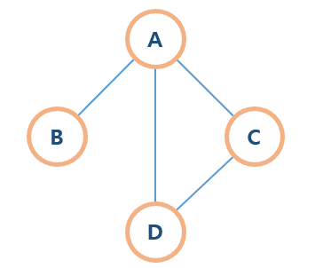
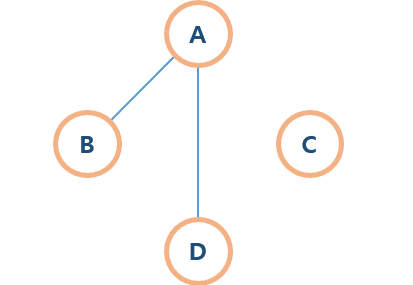

# :bookmark: 그래프

노드(vertice)와 간선(정점/edge/arcs)로 이루어진 자료 구조.



#### 그래프 용어

- **노드(node)** : 정점(vertice)라고도 불리며,  일반적으로 노드에는 데이터가 저장됨

- **간선(edge)**:  링크, arcs라고도 불리며, 노드간의 관계를 나타냄

- **인접 정점(adjacent vertex) **:  간선에 의해 연결된 정점. 위 그림에서 노드A와 B는 인접 정점이라고 할 수 있다
- **단순 경로(simple-path)**: 경로 중 반복되는 정점이 없는것, 같은 간선을 자나가지 않는 경로

- **차수(degree)**:  무방향 그래프에서 하나의 정점에 인접한 정점의 수. 위 그래프에서 A의 차수는 3이다.

- **진출차수(out-degree)/진입차수(in-degree) **:  방향그래프에서 사용되는 용어

  **진출 차수** 는 한 노드에서 외부로 향하는 간선의 수,

  **진입차수** 는 외부 노드에서 들어오는 간선의  수

  - 
  
    ​	위 그래프의 A노드에서 진출차수는 2, 진입차수는 1이다.

### 그래프의 특징 

그래프는 **네트워크 모델** 즉, 객체와 이에 대한 관계를 나타내는 유연한 방식으로 이해할 수 있다.

그래프의 순회는 **DFS(깊이 우선 탐색)**, **BFS(너비 우선 탐색)**으로 할 수 있다.

그래프에는 **루트 노드**, **부모-자식**이라는 개념이 **없다** 

그래프마다 간선이 없을수도 있고, 있을수도 있다.

**트리**는 그래프의 한 종류이다.


### 그래프의 종류

#### 방향그래프, 무방향그래프

- **방향 그래프(Directed Graph)**

  

  간선에 방향성이 추가된 그래프이다. 위 그래프의 흐름은 **A에서 B로** 진행되며, **<A,B>**로 표기할 수 있다.

  ex) 일방통행 도로, 한 번 지나가면 무너지는 다리

- **무방향 그래프(Undirected Graph)**

  

  방향성이 없는 그래프이다.  A에서 B로, B에서 A로도 갈 수 있으며 **(A,B)**로 표기할 수 있다.

   ex) 양방향 도로, 일반적인 길 등

#### 가중치 그래프



그래프 간선에 **비용/가중치가 부여**되어있는 그래프이다.

ex) 각 섬 사이를 지나는데 걸리는 시간 등

#### 사이클, 비순환 그래프

- **사이클(Cycle)**

  

  ​	단순 경로에서 **시작 정점과 도착 정점이 동일**한 그래프이다. 위 사진에서는 A에서 시작하여 A로 끝난다.

- **비순환 그래프**

  사이클 그래프를 제외한 그래프로, 사이클이 없는 그래프이다.

#### 완전 그래프, 부분 그래프

- **완전 그래프**

  

  **모든 정점이 서로 연결**되어있는 그래프이다.

- **부분 그래프**

  완전 그래프가 아닌, 그래프는 부분 그래프이다.

#### 연결 그래프, 비연결 그래프

- **연결 그래프**

  

  ​	노드들이 하나도 빠짐없이 간선에 의해 **연결되어 있는** 그래프이다. 

- **비연결 그래프**

  

  노드들 중, 간선에 의해 **연결되어있지 않은** 노드가 있는 그래프이다.

#### 신장 트리(Spanning Tree)


-  그래프의 **모든 정점을 포함**하는 트리
- 그래프의 **최소 연결 부분 그래프**(간선의 수가 제일 적은 그래프)
- 그래프에서 **일부 간선의 채택**하여 만든 그래프
  - **하나의 그래프**에선 **여러개의 신장 트리**가 나올 수 있다
  - 
- **트리의 특수한 형태**, 사이클을 포함해선 안된다.

#### 최소 신장 트리(Minimal Spanning Tree/ MST)

- 각 **간선에 가중치가 부여**되어 있을 때, 가중치를 고려하여 **최소 비용의 신장트리**를 구하는 것
- 크루스칼, 프림 알고리즘을 이용해서 구할 수 있다.

#### 비순환 방향 그래프

- **순환하지 않고**(사이클 그래프가 아님. 즉, 어떻게 되는 시작노드와 끝나는 노드가 다름) **방항성**만 갖는 것
- **트리**가 여기에 속해있다

### 그래프 구현 방법	

#### 인접 행렬

인접 행렬은 **이차원 배열** 을 이용하는 방식이다.


완성된 배열의 모양은 A, B, C, D 노드에 다른 노드들이 **인접 정점**이라면 **1**, 아니면 **0**을 넣어준다.

즉,

```javascript
if(노드 i,j를 잇는 간선이 그래프에 존재) {
	M[i][j] = 1;
}
else{
	M[i][j] = 0;
}
```

이렇게 표현할 수 있다.  여기서 노드 i,j는 그림의 a, b, c, d 노드들을 숫자 1, 2, 3, 4로 표현한것 이라고 볼 수 있다.

**구현하기 쉽다**는 장점이 있지만, 인접 리스트보다는 **느리다**라는 단점이 있다.

**노드 개수의 제곱**에 해당하는 공간을 차지한다. O(n) 이다

#### 인접 리스트

인접 리스트는 **연결리스트**를 이용한다.


연결리스트로 표현해서, 각 노드에 인접하게 연결되어있는 노드들을 순서에 상관없이 이어준다. 

인접 행렬보다**빠르다** 라는 장점이 있지만, 인접 행렬보다 **구현하기 어렵다**라는 단점이 있다.

연결된 간선만의 정보를 저장해서 **간선의 개수** 만큼의 공간을 차지한다.  O(n^2)이다. 

간선이 m일때, 총 노드의 수는 2m개이다.

#### 참고자료

[[자료구조]Graph란 - heejeong kwon](https://gmlwjd9405.github.io/2018/08/13/data-structure-graph.html)

[[자료구조]그래프(Graph) - 도라도라](https://blog.naver.com/kbs4674/220727852469)

[[알고리즘]최소 신장 트리(MST, MinimumSpanningTree란)](https://gmlwjd9405.github.io/2018/08/28/algorithm-mst.html)

[그래프 알고리즘 정리 - wan088]([https://velog.io/@wan088/%EA%B7%B8%EB%9E%98%ED%94%84-%EC%95%8C%EA%B3%A0%EB%A6%AC%EC%A6%98-%EC%A0%95%EB%A6%AC#%EA%B7%B8%EB%9E%98%ED%94%84](https://velog.io/@wan088/그래프-알고리즘-정리#그래프))